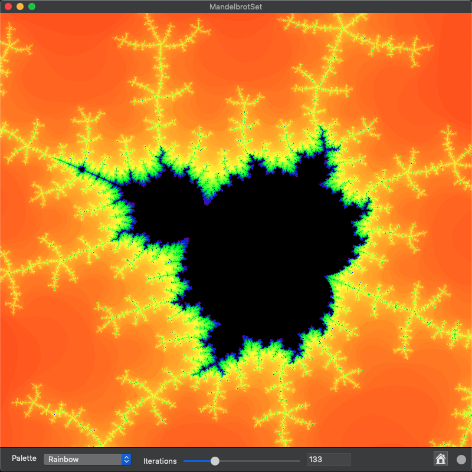

Mandelbrot Set for MacOS.

This is a toy project that I used to learn MacOS and Swift programming.

It implements a SIMD-optimized Mandelbrot Set display with simple
controls for pan, zoom, color palette selection, and iteration control.

On my Macbook Pro it renders each image in about 50 ms. Be sure to
compile with optimization enabled.

